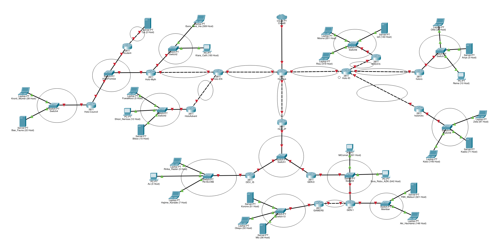

# Jarkom-Modul-4-IT18-2024

**KELOMPOK IT18**
| Nama | NRP |
|---------------------------|------------|
|Hazwan Adhikara Nasution | 5027231017 |
|Farand Febriansyah | 5027231084 |

<hr>

## Topology

**Cisco Packet Tracer**



# CIDR

## Topology


## **Pembagian IP**


## Pennggabungann

### Langkah 1


### Langkah 2


### Langkah 3


### Langkah 4


### Langkah 5


### Langkah 6


### Langkah 7


### Langkah 8


### Langkah 9


### Langkah 10


### Langkah 11


## **Tree**


## **Network Configuration**

### Hololive (Gateway)
```
#A15
bash
auto eth1
iface eth1 inet static
    address 192.242.66.5
    netmask 255.255.255.252

#A1
auto eth2
iface eth2 inet static
    address 192.242.4.5
    netmask 255.255.255.252

#A8
auto eth3
iface eth3 inet static
    address 192.242.10.25
    netmask 255.255.255.252
```

### Holo-EN (Gateway)
```
#A15
auto eth0
iface eth0 inet static
    address 192.242.66.6
    netmask 255.255.255.252
    gateway 192.242.66.5

#A16
auto eth1
iface eth1 inet static
    address 192.242.66.1
    netmask 255.255.255.252

#A21
auto eth2
iface eth2 inet static
    address 192.242.16.33
    netmask 255.255.255.252
```

### Holo-Myth (Gateway)
```
#A16
auto eth0
iface eth0 inet static
    address 192.242.66.2
    netmask 255.255.255.252
    gateway 192.242.66.1

#A17
auto eth1
iface eth1 inet static
    address 192.242.64.1
    netmask 255.255.254.0

#A19
auto eth2
iface eth2 inet static
    address 192.242.32.65
    netmask 255.255.255.248
```

### Gura_Ame_Ina (Client)
```
#A17
auto eth0
iface eth0 inet static
    address 192.242.64.2
    netmask 255.255.254.0
    gateway 192.242.64.1
```

### Kiara_Calli (Client)
```
#A17
auto eth0
iface eth0 inet static
    address 192.242.64.3
    netmask 255.255.254.0
    gateway 192.242.64.1
```

### Holo Advent (Gateway)
```
#A21
auto eth0
iface eth0 inet static
    address 192.242.16.34
    netmask 255.255.255.252
    gateway 192.242.16.33

#A22
auto eth1
iface eth1 inet static
    address 192.242.16.1
    netmask 255.255.255.224
```

### FuwaMoco (Client)
```
#A22
auto eth0
iface eth0 inet static
    address 192.242.16.2
    netmask 255.255.255.224
    gateway 192.242.16.1
```

### Shiori_Nerissa (Client)
```
#A22
auto eth0
iface eth0 inet static
    address 192.242.16.3
    netmask 255.255.255.224
    gateway 192.242.16.1
```

### Biboo (Client)
```
#A22
auto eth0
iface eth0 inet static
    address 192.242.16.4
    netmask 255.255.255.224
    gateway 192.242.16.1
```

### Project-Hope (Gateway)
```
#A19
auto eth0
iface eth0 inet static
    address 192.242.32.66
    netmask 255.255.255.248
    gateway 192.242.32.65

#A18
auto eth1
iface eth1 inet static
    address 192.242.32.73
    netmask 255.255.255.248
```

### Irys (Client)
```
#A18
auto eth0
iface eth0 inet static
    address 192.242.32.74
    netmask 255.255.255.248
    gateway 192.242.32.73
```

### Holo-Council (Gateway)
```
#A19
auto eth0
iface eth0 inet static
    address 192.242.32.67
    netmask 255.255.255.248
    gateway 192.242.32.65

#A20
auto eth1
iface eth1 inet static
    address 192.242.32.1
    netmask 255.255.255.192
```

### Kronii_Mumei (Client)
```
#A20
auto eth0
iface eth0 inet static
    address 192.242.32.2
    netmask 255.255.255.192
    gateway 192.242.32.1
```

### Bae_Fauna (Client)
```
#A20
auto eth0
iface eth0 inet static
    address 192.242.32.3
    netmask 255.255.255.192
    gateway 192.242.32.1
```

### Holo-ID (Gateway)
```
#A1
auto eth0
iface eth0 inet static
    address 192.242.4.6
    netmask 255.255.255.252

#A2
auto eth1
iface eth1 inet static
    address 192.242.4.1
    netmask 255.255.255.252

#A4
auto eth2
iface eth2 inet static
    address 192.242.16.65
    netmask 255.255.255.252

#A6
auto eth3
iface eth3 inet static
    address 192.242.34.1
    netmask 255.255.255.252
```
### AREA15 (Gateway)
```
#A2
auto eth0
iface eth0 inet static
    address 192.242.4.2
    netmask 255.255.255.252
    gateway 192.242.4.1

#A3
auto eth1
iface eth1 inet static
    address 192.242.0.1
    netmask 255.255.252.0
```

### lofi (Client)
```
#A3
auto eth0
iface eth0 inet static
    address 192.242.0.2
    netmask 255.255.252.0
    gateway 192.242.0.1
```

### Moona (Client)
```
#A3
auto eth0
iface eth0 inet static
    address 192.242.0.3
    netmask 255.255.252.0
    gateway 192.242.0.1
```

### Risu (Client)
```
#A3
auto eth0
iface eth0 inet static
    address 192.242.0.4
    netmask 255.255.252.0
    gateway 192.242.0.1
```

### holoro (Gateway)
```
#A4
auto eth0
iface eth0 inet static
    address 192.242.16.66
    netmask 255.255.255.252
    gateway 192.242.16.65

### A5
auto eth1
iface eth1 inet static
    address 192.242.16.1
    netmask 255.255.252.192
```

### Ollie (Client)
```
#A5
auto eth0
iface eth0 inet static
    address 192.242.16.2
    netmask 255.255.252.192
    gateway 192.242.16.1
```

### Anya (Client)
```
#A5
auto eth0
iface eth0 inet static
    address 192.242.16.3
    netmask 255.255.252.192
    gateway 192.242.16.1
```

### Reine (Client)
```
#A5
auto eth0
iface eth0 inet static
    address 192.242.16.4
    netmask 255.255.252.192
    gateway 192.242.16.1
```

### holoh3ro (Gateway)
```
#A6
auto eth0
iface eth0 inet static
    address 192.242.34.2
    netmask 255.255.255.252
    gateway 192.242.34.1
```
